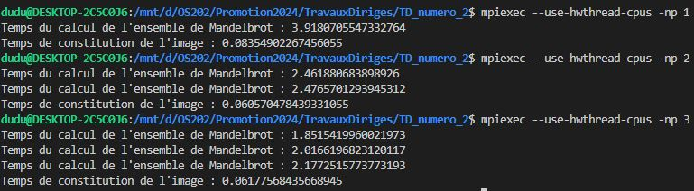
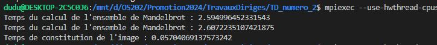

# Réponses

## Exercice 1

### 1.1

### 1.2

En utilisant la Loi d'Amdhal:

$$

S_{speed} = \frac{1}{(1 - p) + \frac{p}{s} }

$$
p c'est la représentation du temps d'exécution par la tâche qu'on va optimizer , 90%, s c'est le speed up sur cette tâche. Si $s \gg 1$, on a:

$$
S_{speed} \sim \frac{1}{(1 - 0.9)} \sim 10
$$
($S_{speed}$ approche le valeur...)

Alors, 10 est le speed up maximale qu'on peut avoir. Comme le calcul qu'on parallélise represente 90% du temps total, un speedup de 2-3 parait raisonnable. Si on considere p = 0.9 l'expression du nombre de nôdes par le speedup demandé $S_{speed}$ est:

$$
n = \frac{0.9 S_{speed}}{1 - 0.1 S_{speed} }
$$

pour un speedup entre 2 et 3, on a besoin de 2-4 cores.

Pour la loi de Gustafson, la prémier situation nous donne:

$$
S_(n) = \frac{t_{s} + nt_{p}}{t_{s} + t_{p}} = \frac{t_{s} + t_{p} + (n-1)t_{p}}{t_{s} + t_{p}}= 1+(n-1)\frac{t_{p}}{t_s + t_p} = 4

$$
Alors:
$$

\frac{t_{p}}{t_s + t_p} = \frac{3}{n-1}
$$

Si on a deux fois la quantité de donnéé à traiter:

$$
S_(n) = \frac{t_{s} + 2nt_{p}}{t_{s} + 2t_{p}} = 1+(n-1)\frac{2t_{p}}{t_s + 2t_p}
$$

### 1.3 Ensemble de Mandelbrot 

#### 1)
C'est le code mandelbrot.py.

Le processus 0 est le 'root'. Pour bien partager les données entre les 'p' cores, , chaque core sera responsable pour les lignes d'index entre $\lfloor \frac{i * height}{p} \rfloor$ et $\lfloor \frac{(i+1) * height}{p} \rfloor $ (attention à la fonction floor), où i est le rank du core.

Chaque core calcule les points de la figure et les met dans l'array convergance (lignes 69-77).

On appele la fonction gather pour mettre les resultats de chaque core dans la liste 'result' du core de rank zero(ligne 80). Les lignes 80+ sont pour corriger les dimensions de result et afficher la figure.

Les resultats pour 1(sequentiel) - 3 cores sont:

(Pour une image de 1024x1024)

Pour deux cores, on a un speedup de $\frac{3.92}{2.48} \sim 1.58$, en utilisant la plus grande durée de calcul des cores en parallèl. Pour trois cores, un speedup de $\frac{3.92}{2.18} \sim 1.8$. On peut voir que les speedups ne sont pas lineaires.

#### 2)
Le code est dans le fichier mandelbrot_maitre.py.

Le code suit le même raisonemment de l'item (1). la différence c'est que le processeur 0 est maintenant le maitre, et ne va pas faire des calculs.

On utilise la même division avec la fonction floor, mais comme 0 ne calcule rien, il ne va rien recevoir. Entre les lignes 66-73, le maitre calcule les index pour chaque processeur et fait un broadcast.

Entre les lignes 78-93 chaque processus crée un array pour mettre les resultats des calculs(convergence), mais l'ensemble du maitre est vide.

À partir de la ligne 97, les resultats sont mis dans la liste result du maitre. On ignore le valeur 'vide' de l'array (qui vient de l'array convergence du maitre créé dans les lignes 78-93) et le graphe est fait.

Pour un speedup de $\frac{3.92}{2.61} \sim 1.50$. C'est un speedup proche du speedup de l'item dernier, mais on utilise 1 core juste pour communiquer/distribuier les données. la quantité de communication est plus grande aussi, ce qui peut causer un overhead en dependant du problème et la quantité de données qu'on envoye entre les processeurs.

### 1.4 Produit matrice-vecteur

#### 1)
Le code est dans le fichier matvec_collone.py .

Comme le problème de calcul dans chaque processeur est indépendent des données des autres processeurs, chaque processeur est responsable pour ses propres arrays.

Si on pense dans la matrice A original, 120x120, chaque processeur aura une version plus petite de dimension (120 x taille_p), où taille_p =$ \lfloor \frac{i * height}{p} \rfloor - \lfloor \frac{(i+1) * height}{p} \rfloor $.

Chaque processeur crée aussi une petite partie du vecteur u, qui dans chaque processeur a des dimensions (taille_p x 1).

Alors chaque processeur obtient un vecteur v de dimensions (120x1), mais on doit les ajouter pour obtenir le vrai resultat.

#### 2)
Le code est dans le fichier matvec_lignes.py .

Le raisonemment est presque le même mais maintenant chaque processeur a un bloc de A de dimensions (taille_p x 120).

Maintenant le vecteur u de chaque processeur a des dimensions (120x1), mais le vecteur v a dimension (taille_p x 1).

On 'gather' les resultats sur une liste dans le processeur 0 e c'est le resultat du produit.
