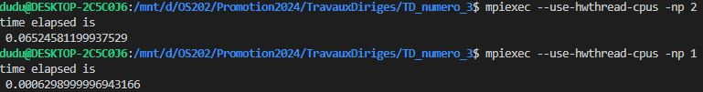

# TD n°3 - parallélisation du Bucket Sort

*Ce TD peut être réalisé au choix, en C++ ou en Python*

Implémenter l'algorithme "bucket sort" tel que décrit sur les deux dernières planches du cours n°3 :

- le process 0 génère un tableau de nombres arbitraires,
- il les dispatch aux autres process,
- tous les process participent au tri en parallèle,
- le tableau trié est rassemblé sur le process 0.

# Réponse

J'ai laissé quelques commentaires par le code. À la fin, j'ai essayé d'utiliser les listes du Python pour mettre les arrays du numpy de façon à utiliser les fonctions scatter et gather, qui sont plus claires que les fonctions Gatherv et Scatterv sur la documentation du mpi4py.

Pour la stratégie, bon, la tâche 0 est responsable pour partager l'array initial et afficher le resultat final. C'est elle qui va aussi obtenir les valeurs possibles pour les pivots et les distribuer. C'est déja dans le code mais la tâche 0 fait aussie des calculs(puisque mon pc n'a que 2 cores).

sort_original, dans la ligne 21, est l'array original, qu'on va trier. La tâche partage cet array en p(nombre de processeurs) petits arrays, de tailles differentes(en utilisant une petite strategie avec la fonction floor que j'ai vu sur le livre à la fin) qui seront dans la liste sendbuf.

On appele un scatter sur la liste sendbuf e chaque processeur reçoit un petit array(en rec, ligne 29) qu'il va utiliser pour obtenir les valeurs possibles pour les pivots. Chaque processeur prendre p+1 valeurs possibles pour les pivots, qui sont envoyés à zero  dans la ligne 38. La tâche zero tire au hasard p+1 pour les pivots et partage sort_original à chaque processeur en utilisant les pivots(lignes 40-49).

Chaque processeur trie l'array reçu (ligne 50).Après un gather(ligne 51), la tache zero affiche les resultats(lignes 52-) et montre la durée du program.

Pour la vitésse entre les deux versions, bon, la version parallèle et plus vite pour les grandes tailles (comme n > 10^6, la figure ci-dessous).

Une augmentation de 2 fois. J'ai essayé d'utiliser 3 cores avec le parametre "--use-hwthread-cpus" mais ce command est un peu étrange dans mon PC...

Mais, ce n'est pas toujours les cas... Pour les petits valeurs de n, l'overhead de communication entre les processeurs n'est pas négligeable et la version parallèle peut être pire.

(pour n=1000)

Comme c'est le cas avec les autres TD, j'ai toujour utilisé le livre de Micheal Quinn, "Parallel Programming in C with MPI and OpenMP".
