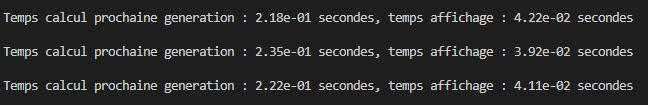
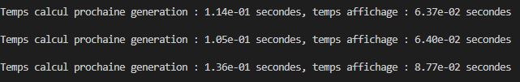

# Stratégie

Bon, je vais utiliser 1 processeur pour faire la affichage et le reste va faire les calculs.
La division de calcul parmi plusieurs processeurs ne sera pas un probleme, puisque le calcul de la prochaine iteration (t+1) n'utilise que la grille ancienne (la grid du moment t). Ainsi, le calcul est independant et la communication entre chaque processeur de calcul est limitée(on fait un all gather juste pour mettre a jour la nouvelle grille). 

On crée deux communicators, un qui contient tous les processeurs, le 0 est qui va afficher les resultats, e um nouveau communicator, entre les processeurs de calcul. On pourrait utiliser un seul communicator et partager les calculs parmi tous les processeurs, mais je voulais apprendre un peu commment utiliser la creation d'autre communicator.

On choit alors le paradigm maitre-eclave juste par le fait que c'est une strategie que je n'avais pas compris e plus difficile d'appliquer, alors ç'était une façon de l'apprendre.

Dans la ligne 35, on crée un nouveau communicateur, qui ne reçoit pas 0. Tous les processeurs ont une copie de la grille, et tous appelent la fonction de mise a jour de cette grile. Néanmoins, dans cette fonction compute_next_iteration, juste les processeurs de calcul, les processeur qui sont dans le nouveau communicateur, vont travailer(ligne 79).

Pour la comparaison entre les deux codes, on peut regarder les images ci-dessous:

Le code en version parallèle avec 3 processeurs, 1 pour afficher les resultats et les autres pour des calculs, est:

Un speed up presque idéal de 2 fois.

Cependant, si on divide la grille dans les parties trop petits, le coût du calcul devient plus cher. Ainsi, on ne peut pas dire que la version parallèle sera toujour plus éfficace.

